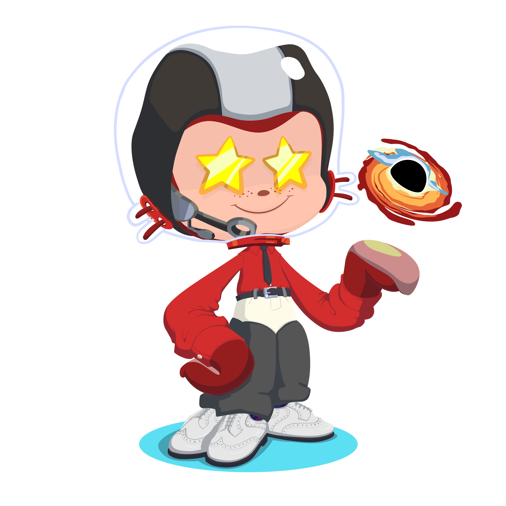

<!-- HEADER -->
<picture>
  <source media="(prefers-color-scheme: dark)" srcset="https://capsule-render.vercel.app/api?type=waving&height=200&color=0:0d1117,50:1a1b4b,100:4c1d95&text=ApostL78&desc=Backend%20Developer&fontColor=ffffff&descAlignY=65&animation=fadeIn">
  <source media="(prefers-color-scheme: light)" srcset="https://capsule-render.vercel.app/api?type=waving&height=200&color=0:667eea,100:764ba2&text=ApostL78&desc=Backend%20Developer&fontColor=ffffff&descAlignY=65&animation=fadeIn">
  
</picture>

<!-- OCTOCAT -->

  

<!-- SKILL ICONS -->

  <picture>
    <source media="(prefers-color-scheme: dark)" srcset="https://skillicons.dev/icons?i=python,django,fastapi,postgres,redis,docker,git,linux,bash,rabbitmq&perline=10&theme=dark">
    <source media="(prefers-color-scheme: light)" srcset="https://skillicons.dev/icons?i=python,django,fastapi,postgres,redis,docker,git,linux,bash,rabbitmq&perline=10&theme=light">
    
  </picture>

<!-- WAVE DIVIDER 1 -->
<picture>
  <source media="(prefers-color-scheme: dark)" srcset="https://capsule-render.vercel.app/api?type=wave&height=60&color=0:0d1117,50:1a1b4b,100:4c1d95&section=footer">
  <source media="(prefers-color-scheme: light)" srcset="https://capsule-render.vercel.app/api?type=wave&height=60&color=0:667eea,100:764ba2&section=footer">
  
</picture>

<!-- ACTIVITY: ISOCALENDAR -->
<h3 align="center">2026</h3>

  <picture>
    
  </picture>

<!-- ACTIVITY: PIXEL ART WALL -->
<h3 align="center">Pixel Art Wall (2022 — 2025)</h3>

  <picture>
    
  </picture>

<!-- WAVE DIVIDER 2 -->
<picture>
  <source media="(prefers-color-scheme: dark)" srcset="https://capsule-render.vercel.app/api?type=wave&height=60&color=0:0d1117,50:1a1b4b,100:4c1d95&section=footer">
  <source media="(prefers-color-scheme: light)" srcset="https://capsule-render.vercel.app/api?type=wave&height=60&color=0:667eea,100:764ba2&section=footer">
  
</picture>

<!-- PINNED PROJECTS -->
<h3 align="center">Pinned Projects</h3>

  <picture>
    
  </picture>

<!-- ACHIEVEMENTS -->
<h3 align="center">Achievements</h3>

  <picture>
    
  </picture>

<!-- WAVE DIVIDER 3 -->
<picture>
  <source media="(prefers-color-scheme: dark)" srcset="https://capsule-render.vercel.app/api?type=wave&height=60&color=0:0d1117,50:1a1b4b,100:4c1d95&section=footer">
  <source media="(prefers-color-scheme: light)" srcset="https://capsule-render.vercel.app/api?type=wave&height=60&color=0:667eea,100:764ba2&section=footer">
  
</picture>

<!-- LEETCODE -->
<h3 align="center">LeetCode</h3>

  <picture>
    
  </picture>

<!-- STARLISTS -->
<h3 align="center">Star Lists</h3>

  <picture>
    
  </picture>

<!-- FOOTER -->
<picture>
  <source media="(prefers-color-scheme: dark)" srcset="https://capsule-render.vercel.app/api?type=waving&height=120&color=0:4c1d95,50:1a1b4b,100:0d1117&section=footer">
  <source media="(prefers-color-scheme: light)" srcset="https://capsule-render.vercel.app/api?type=waving&height=120&color=0:764ba2,100:667eea&section=footer">
  
</picture>
